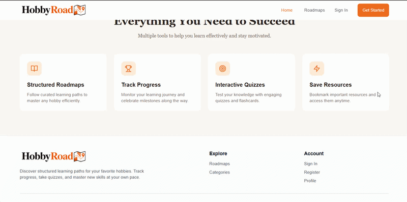

# Hobby Roadmap

Hobby Roadmap is a full-stack learning platform for discovering structured hobby roadmaps, tracking progress, saving resources, and practicing with quizzes and flashcards.

## Demo



## Features

- Browse hobby categories and curated learning roadmaps
- View roadmap stages, resources, estimated time, difficulty, and tags
- Register, log in, update a profile, and save roadmaps
- Track completed roadmap resources
- Take quizzes and review flashcard sets
- Manage categories, roadmaps, resources, quizzes, and flashcards from the admin dashboard
- Explore API documentation through Swagger UI

## Tech Stack

- Frontend: React, TypeScript, Vite, Tailwind CSS, React Router, TanStack Query
- Backend: Node.js, Express, MongoDB, Mongoose
- Auth: JWT with protected and admin-only routes
- Docs: Swagger UI
- Deployment: Netlify, Back4App, MongoDB Atlas

## Deployment

- Frontend deployed on Netlify
- Backend deployed on Back4App
- Database hosted on MongoDB Atlas

## Project Structure

```text
frontend/        React/Vite client
server/          Express API, Mongoose models, routes, controllers, seed data
server/docs/     Backend route and model reference
```

## Getting Started

### Prerequisites

- Node.js
- npm
- MongoDB connection string

### Backend Setup

```bash
cd server
npm install
```

Create `server/.env`:

```env
MONGO_URI=your_mongodb_connection_string
JWT_SECRET=your_jwt_secret
JWT_EXPIRES_IN=7d
PORT=5000
```

Run the API:

```bash
npm run dev
```

The API runs on `http://localhost:5000`.

### Seed Sample Data

From `server/`, run:

```bash
node seed.js
```

The seed script creates sample categories, a full-stack roadmap, resources, quizzes, flashcards, and test users:

```text
Admin: admin@email.com / adminpassword
User: beginner@example.com / userpassword
User: advanced@example.com / userpassword
```

### Frontend Setup

```bash
cd frontend
npm install
npm run dev
```

The frontend runs on `http://localhost:3000`.

By default, the frontend uses `http://localhost:5000/api`. To override it, create `frontend/.env`:

```env
VITE_API_URL=http://localhost:5000/api
```

## Useful Scripts

Backend:

```bash
npm run dev
npm start
```

Frontend:

```bash
npm run dev
npm run build
npm run preview
npm run lint
```

## API

Base URL: `http://localhost:5000/api`

- Auth: `/api/auth`
- Categories: `/api/categories`
- Roadmaps: `/api/roadmaps`
- Resources: `/api/resources`
- Quizzes: `/api/quizzes`
- Flashcards: `/api/flashcards`
- Health check: `/api/health`
- Swagger UI: `/api/docs`
- Swagger JSON: `/api/docs.json`

For a more detailed backend reference, see `server/docs/backend-context.md`.
